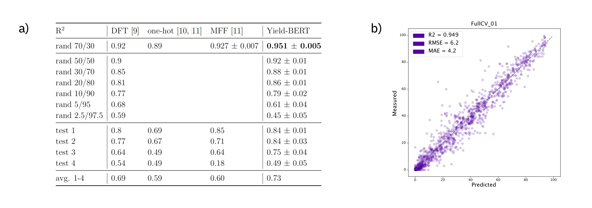
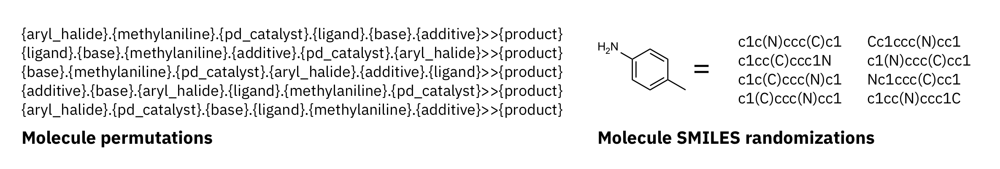
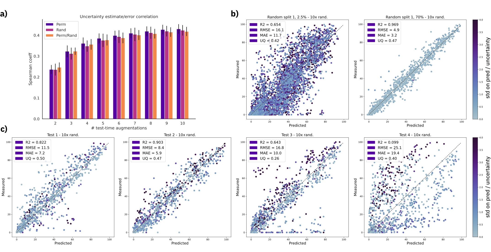
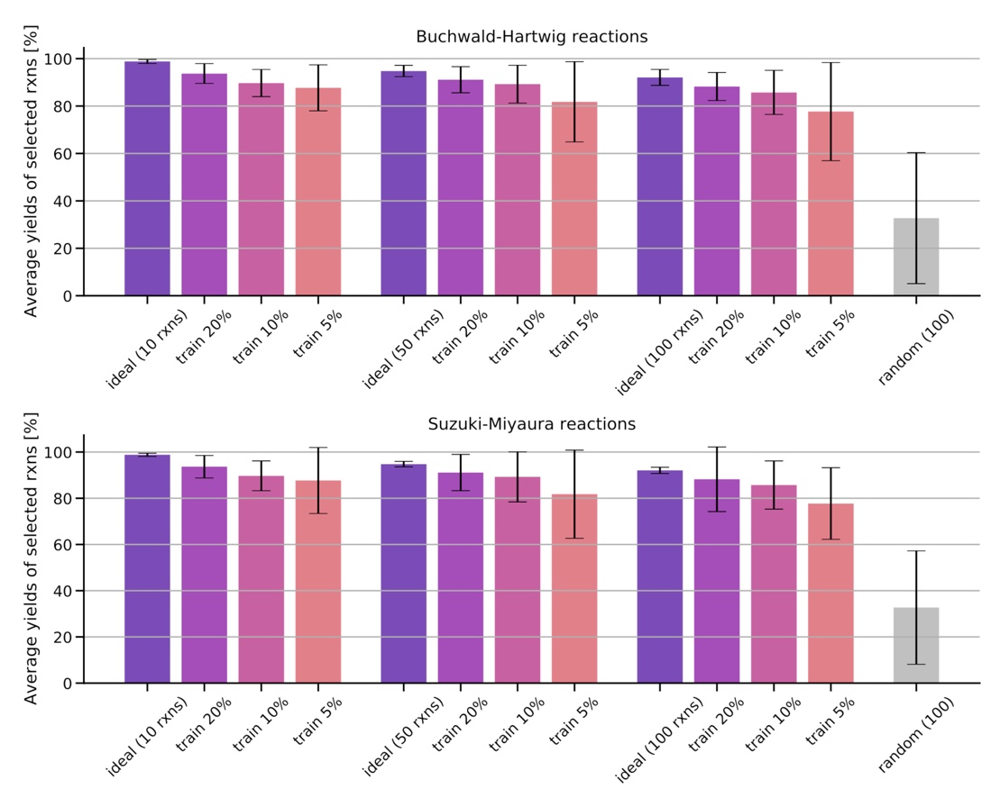
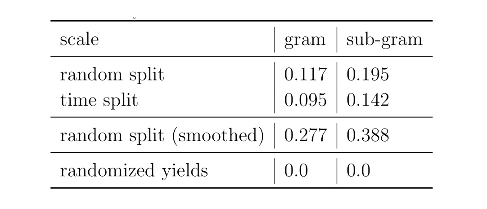

# Predicting Chemical Reaction Yields
> Predicting the yield of a chemical reaction from a reaction SMILES using Transformers


Artificial intelligence is driving one of the most important revolutions in organic chemistry. Multiple platforms, including tools for reaction prediction and synthesis planning based on machine learning, successfully became part of the organic chemists’ daily laboratory, assisting in domain-specific synthetic problems. Unlike reaction prediction and retrosynthetic models, reaction yields models have been less investigated, despite the enormous potential of accurately predicting them. Reaction yields models, describing the percentage of the reactants that is converted to the desired products, could guide chemists and help them select high-yielding reactions and score synthesis routes, reducing the number of attempts. So far, yield predictions have been predominantly performed for high-throughput experiments using a categorical (one-hot) encoding of reactants, concatenated molecular fingerprints, or computed chemical descriptors. Here, we extend the application of natural language processing architectures to predict reaction properties given a text-based representation of the reaction, using an encoder transformer model combined with a regression layer. We demonstrate outstanding prediction performance on two high-throughput experiment reactions sets. An analysis of the yields reported in the open-source USPTO data set shows that their distribution differs depending on the mass scale, limiting the dataset applicability in reaction yields predictions.

This repository complements our studies on [predicting chemical reaction yields](https://iopscience.iop.org/article/10.1088/2632-2153/abc81d) (published in Machine Learning: Science and Technology) and [data augmentation and uncertainty estimation for yield predictions](https://doi.org/10.26434/chemrxiv.13286741) (presented at the Machine Learning for Molecules Workshop at NeurIPS 2020).

## Install

As the library is based on the chemoinformatics toolkit [RDKit](http://www.rdkit.org) it is best installed using the [Anaconda](https://docs.conda.io/en/latest/miniconda.html) package manager. Once you have conda, you can simply run:

```
conda create -n yields python=3.6 -y
conda activate yields
conda install -c rdkit rdkit=2020.03.3.0 -y
conda install -c tmap tmap -y
```

```
git clone https://github.com/rxn4chemistry/rxn_yields.git
cd rxn_yields
pip install -e .
```

---
**NOTE:**

If you are fine-tuning your own models. Make sure that the pretrained model (from which you start training) is loaded from a folder with the same structure as for our [rxnfp models](https://github.com/rxn4chemistry/rxnfp/tree/master/rxnfp/models/transformers/bert_pretrained).

---

## Approach - predicting yields from reaction SMILES

Transformer models have recently revolutionised Natural Language Processing and were also successfully applied to task in chemistry, using a text-based representation of molecules and chemical reactions called Simplified molecular-input line-entry system (SMILES). 

Sequence-2-Sequence transformers as in [Attention is all you need](http://papers.nips.cc/paper/7181-attention-is-all-you-need) were used for:
- Chemical Reaction Prediction
    - [Molecular Transformer: A Model for Uncertainty-Calibrated Chemical Reaction](https://pubs.acs.org/doi/full/10.1021/acscentsci.9b00576)
    - [Carbohydrate Transformer: Predicting Regio- and Stereoselective Reactions Using Transfer Learning](http://dx.doi.org/10.26434/chemrxiv.11935635)
- Multi-step retrosynthesis
    - [Predicting retrosynthetic pathways using a combined linguistic model and hyper-graph exploration strategy](http://dx.doi.org/10.1039/c9sc05704h)
    - [Unassisted Noise-Reduction of Chemical Reactions Data Sets](https://chemrxiv.org/articles/Unassisted_Noise-Reduction_of_Chemical_Reactions_Data_Sets/12395120/1)
    
Encoder Transformers like [BERT](https://openreview.net/forum?id=SkZmKmWOWH) and [ALBERT](https://openreview.net/forum?id=H1eA7AEtvS) for:
- Reaction fingerprints and classification
    - [Mapping the Space of Chemical Reactions using Attention-Based Neural Networks](https://chemrxiv.org/articles/Data-Driven_Chemical_Reaction_Classification_with_Attention-Based_Neural_Networks/9897365)
- Atom rearrangements during chemical reactions
    - [Unsupervised Attention-Guided Atom-Mapping](https://chemrxiv.org/articles/Unsupervised_Attention-Guided_Atom-Mapping/12298559)
    
Those studies show that Transformer models are able to learn organic chemistry and chemical reactions from SMILES.

Here we asked the question, how well a **BERT** model would perform when applied to a **yield prediction** task:


<div style="text-align: center">

<p style="text-align: center;"> <b>Figure:</b> Pipeline and task description. </p>
</div>

To do so, we started with the reaction fingerprint models from the [rxnfp](https://rxn4chemistry.github.io/rxnfp/) library and added a fine-tuning regression head through [SimpleTransformers.ai](https://simpletransformers.ai). As we don't need to change the hyperparameters of the base model, we only tune the learning rate for the training and the dropout probability. 

We explored two high-throughput experiment (HTE) data sets and then also the yields data found in the USPTO data base.

## Buchwald-Hartwig HTE data set

### Canonical reaction representation

One of the best studied reaction yield is the one that was published by Ahneman et al. in [Predicting reaction performance in C–N cross-coupling using machine learning](https://science.sciencemag.org/content/360/6385/186.full), where the authors have used DFT-computed descriptors as inputs to different machine learning descriptors. There best model was a random forest model. More recently, [one-hot encodings](https://science.sciencemag.org/content/362/6416/eaat8603) and [multi-fingerprint features (MFF)](https://www.sciencedirect.com/science/article/pii/S2451929420300851) as input representations were investigated. Here, we show competitive results starting simply from a text-based reaction SMILES input to our models.

<div style="text-align: center">

<p style="text-align: center;"> <b>Figure:</b> a) Summary of the results on the Buchwald–Hartwig data set. b) Example regression plot for the first random-split. </p>
</div>

### Augmentated reaction representations

We were able to further improve the results on this data set using data augmentation on reaction SMILES (molecule order permuations and SMILES randomisations). This extension will be presented at the NeurIPS 2020 [Machine Learning for Molecules Workshop](https://nips.cc/Conferences/2020/ScheduleMultitrack?event=16136).

<div style="text-align: center">

<p style="text-align: center;"> <b>Figure:</b> The two different data augmentation techniques investigated in the NeurIPS workshop paper. </p>
</div>

#### Results

<div style="text-align: center">

<p style="text-align: center;"> <b>Figure:</b> a) Results on the 70/30 random splits, averaged over 10 splits. b) Comparison of DFT descriptors + RF, canonical SMILES and data augmented randomized SMILES on reduced training sets. c) Out-of-sample test sets</p>
</div>


On random splits 70/30 in a), the data augmented Yield-BERT models perform better than other methods. In the low data regime in b), 98 data points are sufficient to train a Yield-BERT that performs similarly, if not better than DFT descriptors + RF. On out-of-sample test sets in c), the results are less clear.

#### Test-time-augmentation


<div style="text-align: center">

<p style="text-align: center;"> <b>Figure:</b> Test-time augmetation.</p>
</div>

A typical non-bayesian way of estimating epistemic uncertainty, is to take predictions of models trained with different seeds. Here, we explore a different strategy which requires a single model, namely, test-time augmentation. At test-time, we generate multiple augmented versions of the same input and then, average the prediction of the same model and take the standard deviation as uncertainty estimate. 


<div style="text-align: center">

<p style="text-align: center;"> <b>Figure:</b> a) Spearman's rank correlation coefficient with increasing number of test time augmentations. b) Predictions and uncertainty on random split 01 with 2.5% and 70% training data using a fixed molecule order and 10 SMILES randomizations (randomized). c) Out-of-sample test set predictions using a fixed molecule order and 10 SMILES randomizations (randomized). Uncertainty scale was kept the same for all plots and capped at 4.0. MAE = mean average error, RMSE = root mean squared error, UQ = spearman's coefficient $\rho$.</p>
</div>

We show that the uncertainty estimates correlate with the error, even for out-of-sample test sets. 

## Suzuki-Miyaura HTE data set

Another yield data set is the one of Perera et al. from [A platform for automated nanomole-scale reaction screening and micromole-scale synthesis in flow](https://science.sciencemag.org/content/359/6374/429). Using 10 random splits, we demonstrate that the hyperparameters optimised on the Buchwald-Hartwig were transferable to a different HTE reaction data set.

<div style="text-align: center">

<p style="text-align: center;"> <b>Figure:</b> Summary of the results on the Suzuki-Miyaura data set, using the hyperparameters of the Buchwald-Hartwig reactions (3.1) and those tune on one of the random splits. </p>
</div>

## Reaction discovery

Training on a reduced part of the training set containing 5%, 10% 20% of the data, we show that the models are already able to find high-yielding reactions in the remaining data set. 

<div style="text-align: center">

<p style="text-align: center;"> <b>Figure:</b> Average and standard deviation of the yields for the 10, 50, and 100 reactions predicted to have the highest yields after training on a fraction of the data set (5%, 10%, 20%). The ideal reaction selection and a random selection are plotted for comparison. </p>
</div>

## USPTO data sets 

The [largest public reaction data](https://figshare.com/articles/Chemical_reactions_from_US_patents_1976-Sep2016_/5104873) set was text-mined from the US patents by Lowe. There are numerous reasons why yield data in patents is noisy. Therefore, it the data set is not ideal for a yield prediction task. Using Reaction Atlases, made with the tutorial shown in [rxnfp](https://rxn4chemistry.github.io/rxnfp/), we show that while general yield trends exists. The local reaction neighbourhoods are very noisy and better quality data would be required.

<div style="text-align: center">

<p style="text-align: center;"> <b>Figure:</b> Superclasses, yields and yield distribution of the reactions in the USPTO data set divided into gram and subgram scale. </p>
</div>

We performed different experiments using random and time splits on the reaction data. As a sanity check, we compared the results to the one where we randomise the yields of the reactions. In one of the experiments, we smoothed the yield data taking the average of twice its own yield plus the yields of the three nearest-neighbours. This procedure could potentially improve the data set quality by smoothing out originating from (human) errors. Accordingly, the results of the Yield-BERT on the smoothed data set are better than on the original yields. 

<div style="text-align: center">

<p style="text-align: center;"> <b>Figure:</b> Summary of the results on the USPTO data sets. </p>
</div>

## Citation

If you found this repo useful, please cite the following publication:
[Yield-BERT](https://iopscience.iop.org/article/10.1088/2632-2153/abc81d).

```
@article{schwaller2021prediction,
  title={Prediction of chemical reaction yields using deep learning},
  author={Schwaller, Philippe and Vaucher, Alain C and Laino, Teodoro and Reymond, Jean-Louis},
  journal={Machine Learning: Science and Technology},
  volume={2},
  number={1},
  pages={015016},
  year={2021},
  publisher={IOP Publishing}
}
```

and

[Data augmentation strategies to improve reaction yield predictions and estimate uncertainty](https://doi.org/10.26434/chemrxiv.13286741)

```
@article{Schwaller2020augmentation,
author = "Philippe Schwaller and Alain C. Vaucher and Teodoro Laino and Jean-Louis Reymond",
title = "{Data augmentation strategies to improve reaction yield predictions and estimate uncertainty}",
year = "2020",
month = "11",
url = "https://doi.org/10.26434/chemrxiv.13286741",
doi = "10.26434/chemrxiv.13286741"
}
```


The models used in our work are based on the [Huggingface Transformers](https://github.com/huggingface/transformers) library and interfaced through [SimpleTransformers.ai](https://simpletransformers.ai) and our [rxnfp](https://rxn4chemistry.github.io/rxnfp/).
